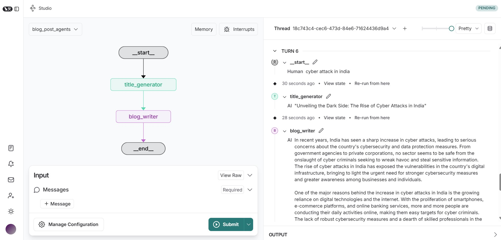

# Blog_Generation_Agent

## AI Blog Generation Workflow using OPENAI API and LangGraph

This is a project about blog generation AI agent. As user provides input, based on that the first node creates a title, the second node creates the content and displays it.

